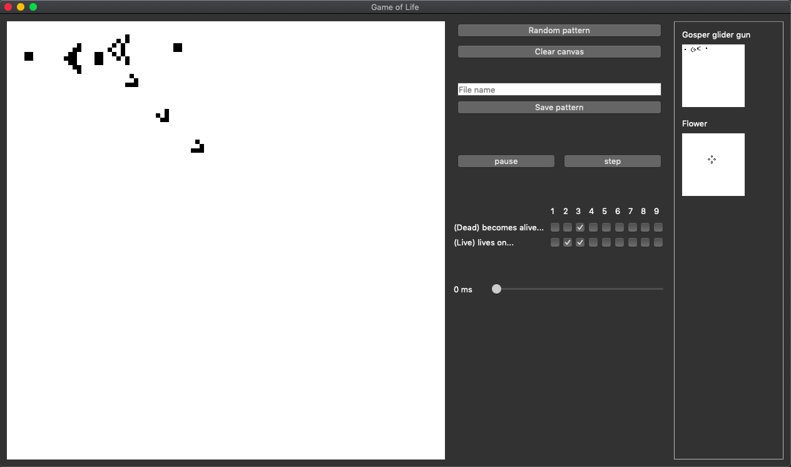

# Game of Life
Python couse 3 mandatory 2 assignment 

In 1970 the British Mathematician John Conway created his "Game of Life" -- a set of rules that mimics the chaotic yet patterned growth of a colony of biological organisms. 
The "game" takes place on a two-dimensional grid consisting of "living" and "dead" cells, 
and the rules to step from generation to generation are simple:

* Overpopulation: if a living cell is surrounded by more than three living cells, it dies.
* Stasis: if a living cell is surrounded by two or three living cells, it survives.
* Underpopulation: if a living cell is surrounded by fewer than two living cells, it dies.
* Reproduction: if a dead cell is surrounded by exactly three cells, it becomes a live cell.

By enforcing these rules in sequential steps, beautiful and unexpected patterns can appear.

# Done project
## Features 
* Able to click anywhere on the canvas and it will toggle the pixel white or black.
* Generate random pattern.
* Clear/reset canvas.
* Save a pattern/canvas with a name for reuse or display.
* Auto play the game and pause auto play, and able to take one step at the time
* Choose new rules for the cells.
* Change how often the canvas updates.
* Click saved patterns/canvas to reinstantiate 

## Behind the scenes
I create a 2d array[100][100] that contains booleans where true is a live cell.
Then I use create a QImage based on this array with black pixels being live cells,
then I scale the image up by 7 so the image becomes 700x700px,
this is so you easily can see whats going on.

Image comparison:

Scale                                            |  No scale
:-----------------------------------------------:|:-----------------------------------------------:
  |   

The window is separated in 3 column; Canvas | Buttons | saved canvas

Game Of Life: Gosper glider gun:

# Mandatory:
As our mandatory 2/exam project we ware able to choose between four projects:
* Game of Life
* Chat System
* Web-based BBS System
* QR-Code Generator

In all projects there are some common requirements:
* Write Pythonic code using the concepts from this course
* Demonstrate correctness using tests, document code coverage
* Separate configuration from implementation
* Apply the DRY principle (Don't Repeat Yourself)

I have chosen Game of Life and will be using PyQt5 as my GUI framework library. 

Objective of project: Implement a GUI-based Game of Life.

Requirements:
* The project must implement a GUI for the user
* Game grid is 100 x 100
* Support for at least two rule sets
* Support for default, random, and user dened initial state
* Configurable speed, and step-by-step progression

